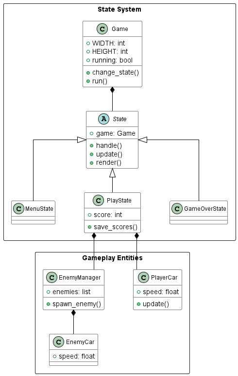
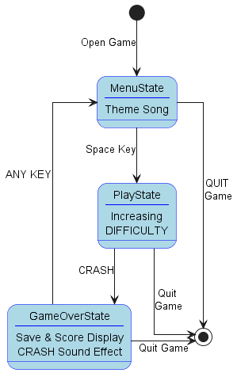
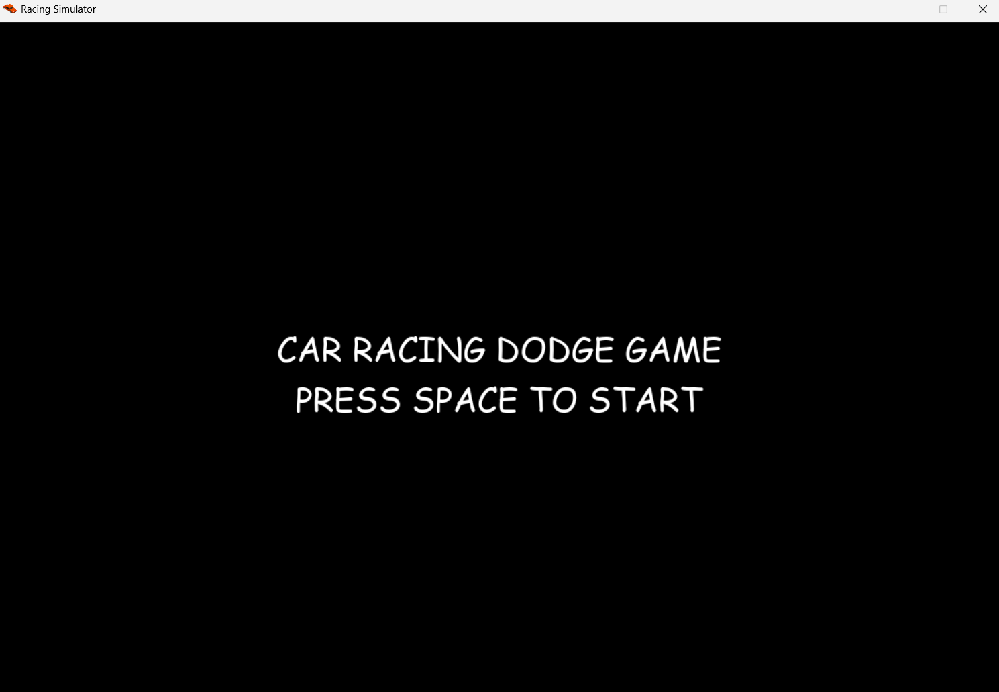
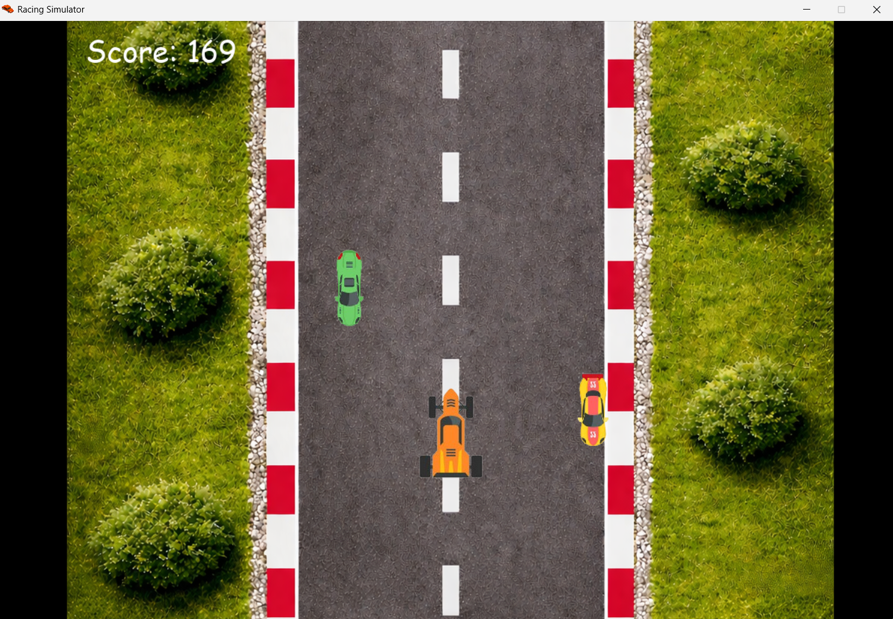
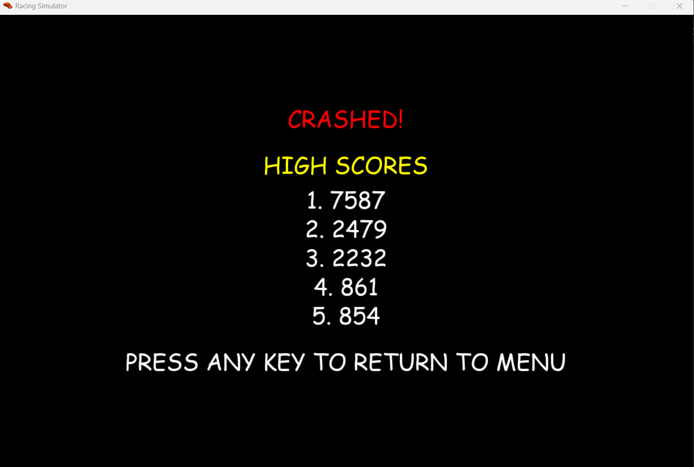

# 🚗 Car Racing Dodge Game


A fast-paced **arcade-style car dodging game** built with **Python** and **Pygame**. Avoid incoming traffic, survive as long as possible, and climb the high score leaderboard.

---

## 🎮 Features

* Smooth player movement with acceleration & deceleration
* Dynamic enemy spawning with lane-switching AI
* Progressive difficulty scaling based on score
* Background music and crash sound effects
* High score system (top 5 saved locally)
* Clean game architecture using state management
* Organized asset handling system

---

## 🗂️ Project Structure, UML and State Diagram 

```
PM2_PROJECT/
│
├── assets/
│   ├── img/
│   ├── audio/
│   ├── asset_manager.py
│   └── audio_manager.py
│
├── background.py
├── enemy_car.py
├── enemy_manager.py
├── player_car.py
├── states.py
├── game.py
├── main.py
├── scores.txt
└── README.md

```
<table align="center">
  <tr>
    <td align="center">
      <br>
      <em>Fig 1: UML Diagram</em>
    </td>
    <td align="center">
      <br>
      <em>Fig 2: State Diagram</em>
    </td>
  </tr>
</table>

---

## ⚙️ Installation

```bash
git clone https://github.com/RobOt1cs-ai/PROGRAMMING_METHODS_2_PROJECT.git
cd PM2_FINAL
```

### Create Virtual Environment

```bash
python -m venv env
```

Activate:

* Windows:

```bash
env\Scripts\activate
```

* Mac/Linux:

```bash
source env/bin/activate
```

### Install Dependencies

```bash
pip install pygame
```

---

## ▶️ Run the Game

```bash
python main.py
```

---

## 🎮 Controls

| Key     | Action         |
| ------- | -------------- |
| ⬅️ / A  | Move Left      |
| ➡️ / D  | Move Right     |
| ⬆️ / W  | Accelerate     |
| ⬇️ / S  | Decelerate     |
| SPACE   | Start Game     |
| ANY KEY | Return to Menu |

---

## 🧠 Gameplay

* Drive within 3 lanes (left, middle, right) and avoid enemy cars
* Enemy cars randomly spawn and may switch lanes
* Speed of map and enemies increases as score increases
* Game ends on collision
* Scores are saved automatically

---

## 📸 Screenshots of The Game

<table align="center">
  <tr>
    <td align="center">
      <br>
      <em>Fig 1: Menu Game</em>
    </td>
    <td align="center">
      <br>
      <em>Fig 2: Gameplay</em>
    </td>
    <td align="center">
      <br>
      <em>Fig 3: Game Over</em>
    </td>
  </tr>
</table>

---

## 🎥 GAMEPLAY DEMO VIDEO

### DEMO VIDEO

https://drive.google.com/file/d/12_hqMcbO_oK0qSl9dXBIXoNR7ofQFQV2/view

---

## 🧪 Code Highlights

### State Management

Clean separation of:

* MenuState
* PlayState
* GameOverState

### Enemy AI

* Random lane switching
* Smooth transitions

### Difficulty Scaling

```python
enemy_speed = 5 + (score ** 0.5) * 0.08
```
---

## 🐞 Known Issues

* Collision may feel strict at high speed
* No pause feature yet
* Map quality

---

## 🚀 Future Improvements

* Add animations (explosions, particles)
* Online leaderboard
* Pause system
* Mobile version
* More sound effects

---

## 📜 License

MIT License

---

## 👨‍💻 Author

### TUAN

https://github.com/RobOt1cs-ai

### DAT

https://github.com/enty4rever

### KHOA

https://github.com/11525016-sketch

---

⭐ If you like this project, give it a star!
